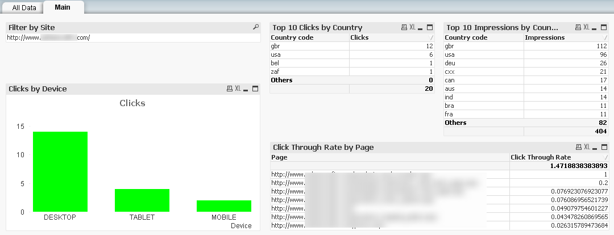

## QVSource Google Webmaster Tools Starter App
A template application showing how to get started using the [QVSource Google Webmaster Tools Connector For QlikView And Qlik Sense](TODO).

**QlikView Users**: You can simply click the ["Download ZIP"](https://github.com/QVSource/QVSource-Google-Webmaster-Tools-Starter-App/archive/master.zip) button on GitHub to grab this application.

**Qlik Sense Users**: You can use the [load script](https://github.com/QVSource/QVSource-Google-Webmaster-Tools-Starter-App/blob/master/Google-Webmaster-Tools-Starter-App-prj/LoadScript.txt) in your Qlik Sense applications.

The content below is copied from the change log in the first tab of the load script.

Change Log
----------------
0.0.8 - 19/10/15
----------------
* Initial version.
